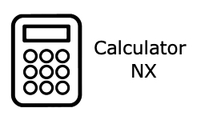

# Calculator_NX
This is my C++ Calculator program, ported to the Nintendo Switch.

This app can now be used in a GUI way, or the normal Command-Line looking way. The app by default uses the GUI version.

## COMPLATION INSTRUCTIONS

Compiling this program requires the libnx library and any other libraries required by libnx. These can be installed via [devkitpro.](https://devkitpro.org/wiki/Getting_Started)

You also need some additional libraries for Borealis from devkitpro. Use `(sudo) (dkp-)pacman -S switch-glfw switch-mesa switch-glm` to download those libraries.

You can then `git clone` this repo to any folder on your computer. To compile on Unix-based distros (these instructions are mostly for macOS & Linux), run `make` while in the root of the repo. To compile on Windows is unknown to me, so feel free to change this for instructions on Windows.

### Complation troubleshooting

When you ran the command `make` and it gives an error like: `Please set DEVKITPRO in your environment`, this means you have to edit the .bash_profile file (this file differs from versions of macOS/Linux) to add the following:
```bash
export DEVKITPRO=/opt/devkitpro
export DEVKITA64=/opt/devkitpro/devkitA64
export DEVKITARM=/opt/devkitpro/devkitARM
export DEVKITPPC=/opt/devkitpro/devkitPPC
export PATH=$DEVKITPPC/bin:$DEVKITPRO/tools/bin:$PATH
```

Any errors relating to borealis should be reported.

## PLANNED FEATURES

There aren't any planned features at the moment.

## CREDITS

Switchbrew for making libnx

The people on the ReSwitched Discord server for helping me

The people on the Switchroot Discord server for helping me on my original Calculator program (this is based on that)

natinusala and any contributors for creating the borealis library

The people on the RetroNX Discord server for helping me on using borealis

## LICENSE

Calculator_NX uses the MIT License. Read the license for more details.

borealis uses the Apache v2.0 License. Read the license in borealis/LICENSE for more details.
